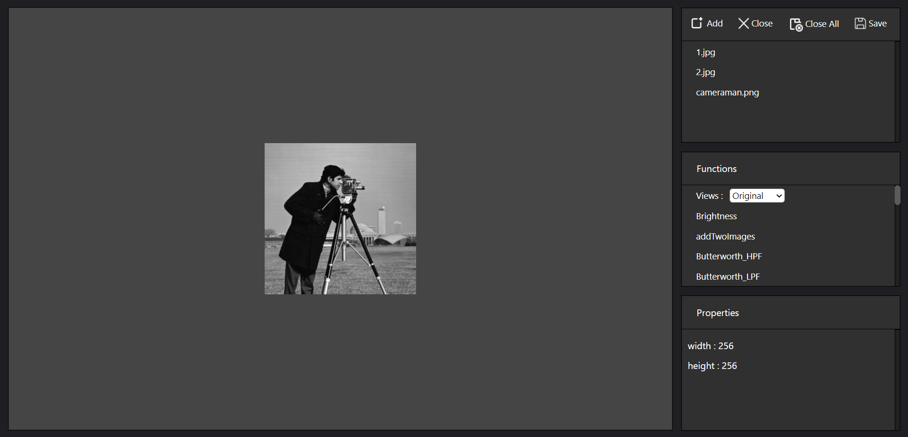
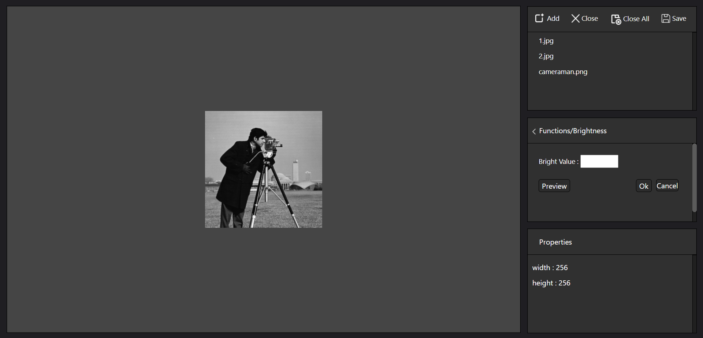
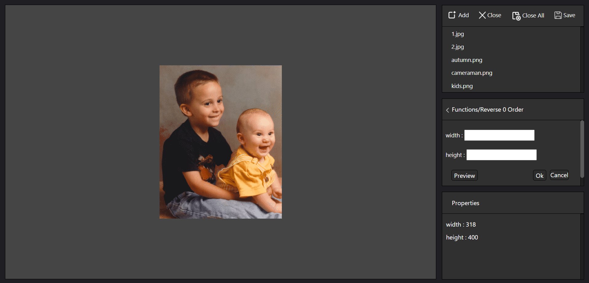

<h1 align="center"> Editor</h1><p align="center">It's an Image Proccessing Website <b>Developed using Matlab</b> <br></p>

[](https://github.com/Ahmed-nd/Editor/fork)

## Installation steps

Open CMD where you want to clone the project & run the following commands

```
git clone https://github.com/Ahmed-nd/Editor.git
cd Editor
mps-start -C prod_server_1
cd project
python manage.py runserver
```

## Installation Instruction
make sure to install this python packages:

* Django
* Pillow
* numpy
* matplotlib
* requests
* json
* asyncio

and on the matlab you need to install MATLAB Production Server and make sure that the program create a server successfully.
then to start the mps server open cmd in the same directory of the zip file and write the commends `mps-start -C prod_server_1` 
and to stop the server write the commends `mps-stop -C prod_server_1`and to check the server state write `mps-status -C prod_server_1`
after the server run and the status return (STARTED, License checked out, License Type: UNKNOWN0, License Number: For EveryOne)
and after that change to the directory project in the zip file and write `python manage.py runserver` to run the web server.

## Functions

* add Two Images
* sub Two Images
* Brightness
* Butterworth HPF
* Butterworth LPF
* Contrast
* Dir Order Resize
* edge detection
* Gamma
* Gaussian Filter
* Gaussian HPF
* Gaussian LPF
* Gray
* Histogram
* Ideal HPF
* Ideal LPF
* Max Filter
* Mean Filter
* Mid point Filter
* Min Filter
* Negative
* Reverse 0 order
* Reverse with order 1
* sharp image
* unsharp algorithm

## Gallery

|  Screenshots    |
|:----:|
|  |
|  |
|  |

## Author

#### Ahmed Nasser

[](https://www.linkedin.com/in/ahmed-nasser-94a765171/)

You can also follow my GitHub Profile to stay updated about my latest projects:

[](https://github.com/Ahmed-nd)

If you liked the repo then kindly support it by giving it a star ⭐!

## License

Copyright (c) 2022 Ahmed N.
